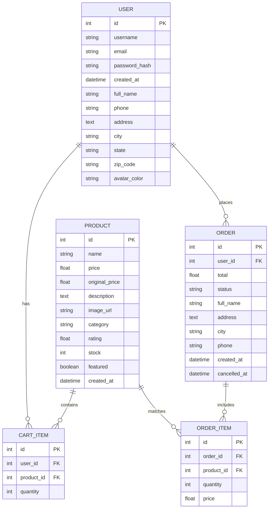

# ⚡ NovaBuy — Premium Flask E-Commerce Platform

NovaBuy is a state-of-the-art, high-fidelity e-commerce application built using **Flask (Python)** on the backend and a **premium glassmorphic dark theme** on the frontend. The application features micro-interactions, real product curation, scroll-triggered animations, and a real-time order cancellation countdown manager.

---

## 🌌 Project Showcase

### Core Aesthetics
- **Dark Mode Design System**: A sleek, immersive color palette using deep blues, purples, and cyans combined with modern typography (Inter).
- **Glassmorphism Components**: Translucent panels with background-blur filters (`backdrop-filter`) and thin luminous borders.
- **Scroll-Triggered Staggered Animations**: Product grids and categories slide up dynamically with custom cubic-bezier transitions as they enter the viewport.

---

## 🛠️ Feature Walkthrough

### 1. Catalog & Real Product Curation
- **Interactive Shop**: Features real-time category filtering, text search, and multiple sorting algorithms (Newest, Price: Low to High, Price: High to Low, Top Rated).
- **Real Imagery**: Overwrote all generic blocks with 33 high-resolution square-cropped product images across Electronics, Fashion, Home & Living, Sports, and Perfumes.
- **Product Details page**: Features interactive hover image zoom, live stock levels, related items suggestions, and an adjustable quantity selector.

### 2. Premium Frontend Interactions (UI/UX)
- **Quick-View Hover Overlay**: Blurs the card background and reveals a clean eye icon overlay (`fa-eye`) on hover.
- **Wishlist Toggle Overlay**: Fades in a decorative floating heart icon (`fa-heart`) that turns rose-red on hover.
- **Shimmer Loaders**: Shifting gradient skeleton animation applied to images while downloading.
- **Back to Top Button**: A styled floating gradient button that slides up after scrolling down 400px, triggering a smooth scroll back to the top on click.
- **Pulsing CTA Buttons**: "Add to Cart" button glows with an expanding gradient pulse on hover.
- **Testimonial Slider Grid**: Glassmorphic testimonials with customer star ratings, text quotes, and initials avatar stamps.
- **Bouncing Flash Notifications**: Custom toast alerts styled with category-specific icons (Success: check-circle, Error: exclamation-circle, Info: info-circle) and bounce entry animations.

### 3. Advanced Backend Workflows
- **User Authentication**: Secure signup, login, and profile modification with password updates utilizing Werkzeug password hashing.
- **Profile Summary**: Displays active shopping statistics (Total Orders, Total Spent) calculated dynamically from historical data.
- **Order Cancellation Countdowns**: Orders can be cancelled within a **10-minute window** from purchase. The detail view runs a client-side JavaScript countdown with a visual color-coded progress bar (Green ➔ Orange ➔ Red) synced to the UTC database deadline. Cancelling an order automatically restocks the products in the database.
- **Dynamic Category Count**: The homepage category cards display the live count of products in each category, computed dynamically on request.

---

## 📂 Project Architecture

```
Flask/
│
├── app.py                  # Main Flask application & routes (Auth, Shop, Cart, Checkout, Orders)
├── models.py               # SQLAlchemy Database Models (User, Product, CartItem, Order, OrderItem)
├── seed_data.py            # Script to seed database with initial products & real image paths
├── requirements.txt        # Python package dependencies
│
├── static/
│   ├── css/
│   │   └── style.css       # Complete stylesheet (Design variables, animations, grids, overlays)
│   ├── js/
│   │   └── main.js         # JavaScript (Mobile toggles, scroll animations, back-to-top, lazy images)
│   └── images/             # Organized 400x400 PNG product assets
│       ├── electronics/
│       ├── fashion/
│       ├── home/
│       ├── sports/
│       └── perfumes/
│
└── templates/              # Jinja2 HTML Templates
    ├── base.html           # Site shell, navigation navbar, animated toast messages, footer
    ├── home.html           # Homepage (Hero showcase, Category grid with counts, Testimonials)
    ├── products.html       # Products grid with Sidebar Filters & search matching
    ├── product_detail.html # Detail views with related item carousels & hover zoom
    ├── cart.html           # Interactive shopping cart quantities
    ├── checkout.html       # Shipping info pre-fills & secure order placement
    ├── orders.html         # User order logs with status badges
    ├── order_detail.html   # Order cancellation timers & itemised receipts
    ├── login.html          # Authentication logins
    └── register.html       # Registration screen
```

---

## 🛢️ Database Schema (`models.py`)

The application uses an SQLite database with Flask-SQLAlchemy object relationships:



---

## ⚡ Setup & Installation

### Prerequisites
- Python 3.8 or higher
- Pip (Python Package Installer)

### 1. Clone & Navigate
```bash
git clone <repository-url>
cd Flask
```

### 2. Virtual Environment & Dependencies
```bash
# Create environment
python -m venv venv

# Activate on Windows
venv\Scripts\activate

# Activate on macOS/Linux
source venv/bin/activate

# Install required packages
pip install -r requirements.txt
```

### 3. Setup Database & Seeding
NovaBuy includes a seeding script that resets the database and populates it with all 33 products configured with the correct category mappings and local image paths.
```bash
python seed_data.py
```
*Expected Output: `SUCCESS: Seeded 33 products with local images successfully!`*

### 4. Run the Dev Server
```bash
python app.py
```
Open your browser and navigate to `http://127.0.0.1:5000` to browse the store.

---

## 🧪 Verification & Development

### Local Config (`.env`)
By default, the application runs on a local SQLite instance (`sqlite:///ecommerce.db`). Create a `.env` file to customize your production variables:
```env
SECRET_KEY=your-custom-production-key
DATABASE_URL=sqlite:///ecommerce.db
FLASK_ENV=development
PORT=5000
```
